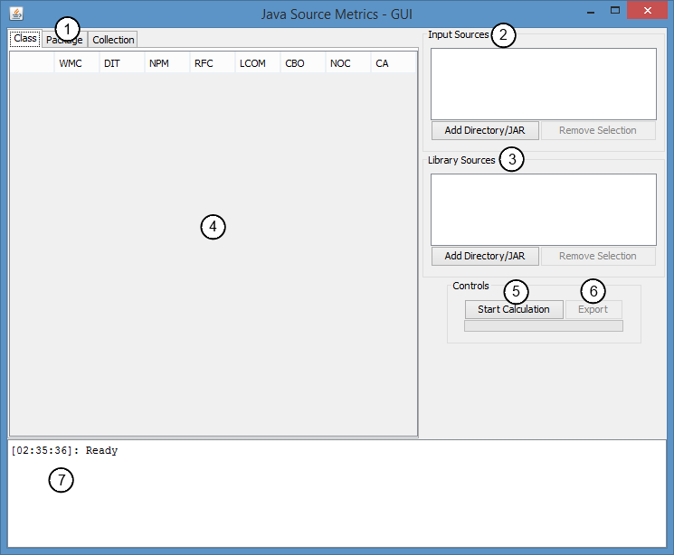

How to use
============

Building JSM produces a buildable .jar file, this file can be executed in two different ways:
* The first is GUI mode, which gets started if there are no additional parameters given when the application is started.
* The second is Script mode, which gets started if there is at least 1 parameters given when the application starts, the parsing of these parameters will be described below in the *Script Mode* section.

To use the application, the following things need to be kept in mind regardless of what mode is used:
* JSM considers the set of all inputs (and the classes they contain) to be a single full application. This has consequences for the results because inter-collection usage and extending is allowed. If the results for just 1 .jar is required then the other .jars should be provided as libraries.
* The application will output detailed logs and exceptions to the `logs` folder in the working directory, if calculation of a unit fails due to an exception, these logs will contain the entire stacktrace.
* When exporting the results to CSV, there are two things that need to be set:
  * Choose whether the metrics get exported by scope (so all CLASS/PACKAGE/COLLECTION datasets go in their own files) or by metric (Each metric/scope combination gets its own file).
  * The export path needs to contain the token `%s`, this token will get replaced by unique identifiers for each metric/scope.

The application comes packaged with two collections of metrics implemented, a brief description of these metrics and their definitions can be found at the bottom of this file. If a custom metric is required please refer to [EXTENDING.md](EXTENDING.md)

GUI Mode
------------



1. `Scope Tabs` switches between the tables displaying the results for the various scopes.
2. `Input Sources` sources of class files that will be subject to calculation. 
3. `Library Sources` sources of class files that will not be subject to calculation, but used for class resolving.
4. `Results Table` will display the results from the last execution, given the scope that the `Scope Tabs` is set to.
5. `Execute` begin calculation of metrics on the current input.
6. `Export` export the results to .csv files.
7. `Console` will show information about failures during execution, as well as any messages sent out by the metrics.


Script Mode
------------

Script mode is meant as a way to automatically process an input set, to give JSM the information it needs to execute the following syntax is used:

* Argument context is controlled through a series of flags, initially the application will ignore any input until the first switching flag is encountered.
* Flags:
  * `--in` signifies the following arguments are treated as input, the arguments have to be a path to either a .jar or a directory tree containing .class files. (The directory tree is required to have a package-structure)
  * `--out` signifies the following arguments are treated as possible targets for the .csv export, these targets will be linearly searched for an unused target where the .csv files can be exported to.
  * `--lib` signifies the following arguments are treated as libraries, he arguments have to be a path to either a .jar or a directory tree containing .class files. (The directory tree is required to have a package-structure)
  * The script mode defaults to export by metric, use `--group-scopes` to set it to export by scope.

Example input for script mode:
```bash
java -jar jsm-1.2.jar --in app.part1.jar app.part2.jar --lib lib1.jar --out results/%s.csv --group-scopes
```


Implemented Metrics
------------

*CKJM*: Class-based metrics based on the paper by [Chidamber and Kemerer](http://ieeexplore.ieee.org/xpl/articleDetails.jsp?arnumber=295895) and the implementation by [Diomidis Spinellis](/dspinellis/ckjm). Please note that the implementation differs in a few places due to errors in the CKJM implementation.
* `Weighted Methods per Class (WMC)` In this implementation, this reflects the total number of methods in a class, including (static) initializers.
* `Depth of Inheritance Tree (DIT)` Number of superclasses that the inspected class has, in Java this is always at least 1 due to Object.
* `Number of Children (NOC)` Reverse of DIT, this tells how many of the inspected classes are subclasses of the inspected class.
* `Coupling between Object Classes (CBO)` This represents the number of classes used within the inspected class.
* `Response for a Class (RFC)` Number of unique methods used within a class, includes all declared methods in that class.
* `Lack of Cohesion in Methods (LCOM)` Represents the degree to which methods share the use of variables in a class.
* `Afferent Couplings (CA)` Reverse-mapping of CBO, represents the number of classes using the inspected class in some way.
* `Number of Public Methods (NPM)` Simple metric that reflects the number of public methods in the inspected class.

*Package Metrics* Package-based metrics based on the paper by [Abdeen, Ducasse and Sahraoui](http://ieeexplore.ieee.org/xpl/articleDetails.jsp?arnumber=6079866). The main way in which metrics are calculated is by defining a `Uses` and `Extends` set for each class. `Uses` is defined as using a class in a method invocation or field access that is not a superclass of the inspected class. `Extends` is the set of classes directly extended or implemented by the class. All results are defined as being between [0..1]
* `Index of Inter-Package Usage (IIPU)` describes how much of the usage within a package is hidden from the outside. A low number of classes used from the outside results in a higher result.
* `Index of Inter-Package Extending (IIPE)` describes how much of the extending within a package is hidden from the outside. A low number of classes extended from the outside results in a higher result.
* `Index of Package Changing Impact (IPCI)` defines how many packages within a collection depend on the specified package, a low number indicates a lot of the other packages depend on its functionality.
* `Index of Inter-Package Usage Diversion (IIPUD)` describes the usage of other packages, a high value indicates use is limited to a small number of packages and a high number of classes in those packages.
* `Index of Inter-Package Extending Diversion (IIPED)` describes the extending of other packages, a high value indicates extending is limited to a small number of packages and a high number of classes in those packages.
* `Index of Package Goal Focus (PF)` describes the way a package is used, it lowers depending on the divergence in sets of classes used by other packages, with cases where the same set of packages is used raises the value.
* `Index of Package Services Cohesion (IPSC)` is an addition to PF, it calculates the cross-over between different sets of used packages, lowering the result if a class is reused for different purposes within a package.

If you want to extend the application with custom metrics, please see [EXTENDING.md](EXTENDING.md)
